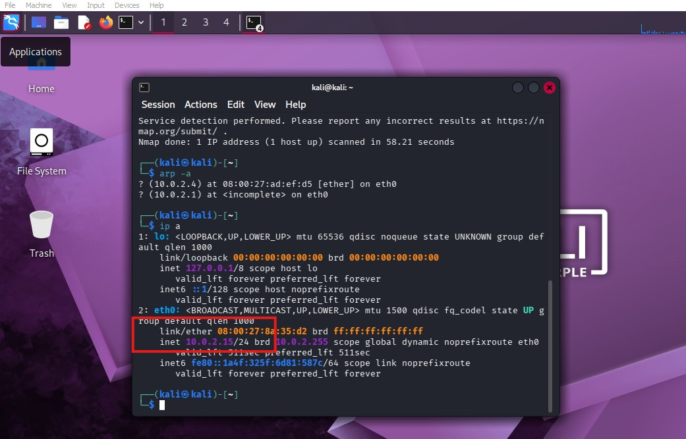
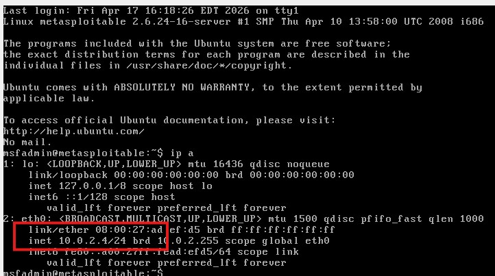
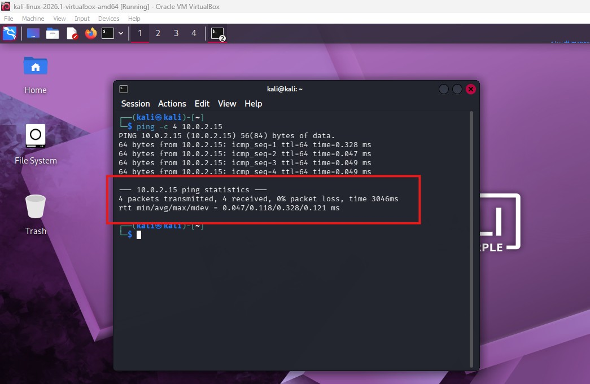
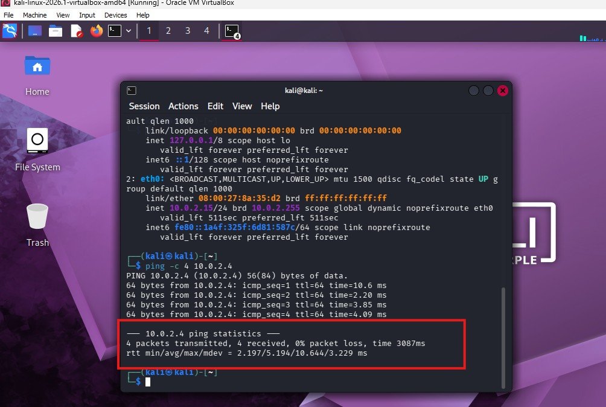
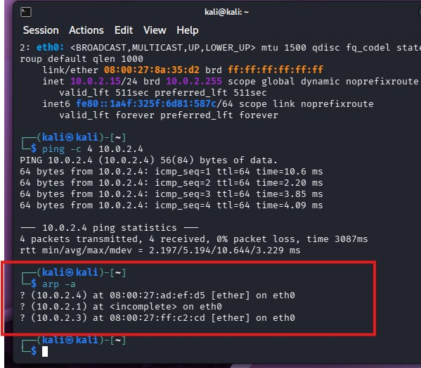
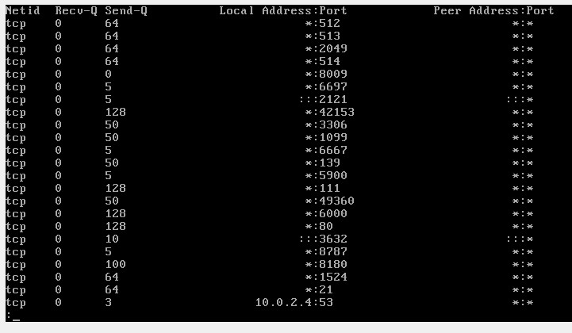
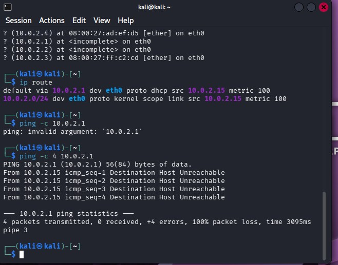

# networksecuritylab-basics
# Lab: Network Utilities & Topology Mapping

## 🛠 Tools & Commands
* `ip a` - Interface configuration
* `ping` - Connectivity testing
* `arp -e` - Address Resolution mapping
* `ss -tulpn` - Port & socket investigation

---

## 📍 Lab Tasks

### Task 1: IP Discovery
I identified the IP addresses for both the Attacker and Target VMs to map the local network.

**Attacker IP Configuration:**

**Target IP Configuration:**

---

### Task 2: Connectivity & ARP Mapping
Verified the connection between nodes and observed the ARP table updates to map hardware addresses.

**Connectivity Verification:**

**Ping Test Results:**

**ARP Table Mapping:**

---

### Task 3: Active Connections & Port Scan
Investigated open ports to understand the services running on the target machine and audit the attack surface.

**Socket Statistics (ss):**

---

## 🚀 Challenges

### Challenge 1: Gateway Discovery
Found the default gateway using the `ip route` command.

### Challenge 2: Local Network Sweeping
Discovered hidden hosts on the subnet by forcing an ARP table update.

### Challenge 3: Socket Investigation
Analyzed the open ports on the local machine to identify active services.

